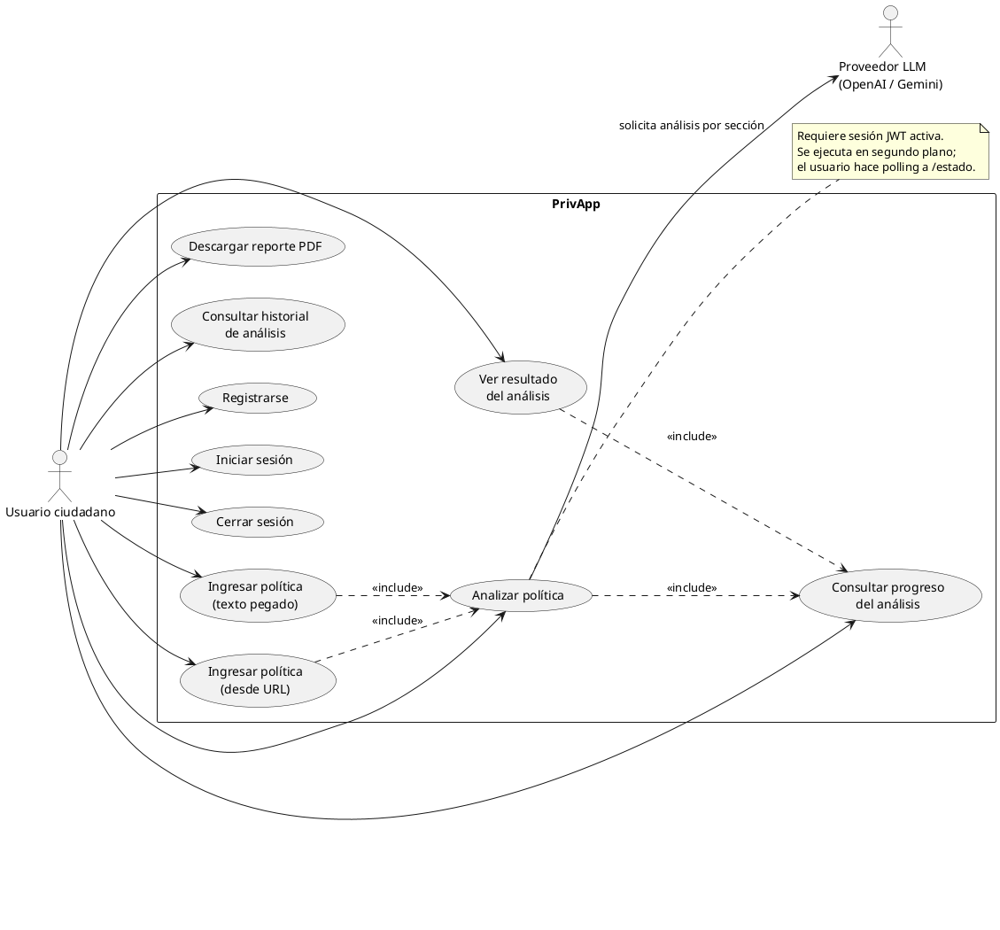
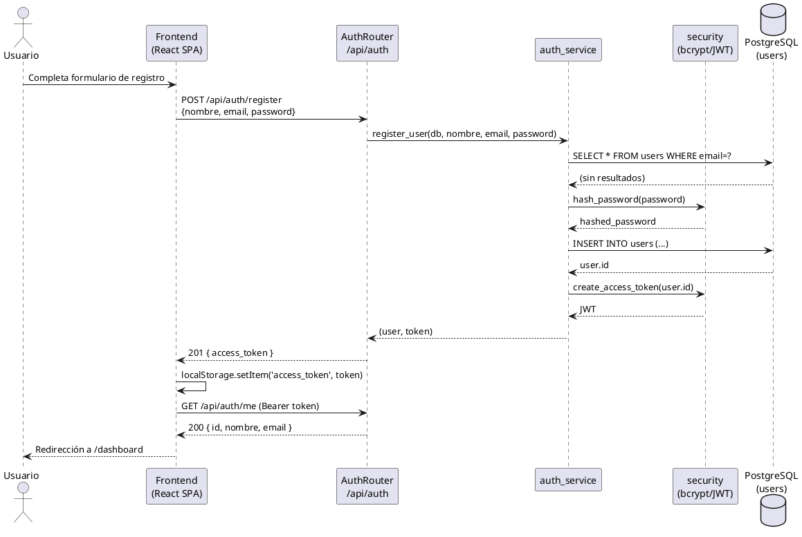
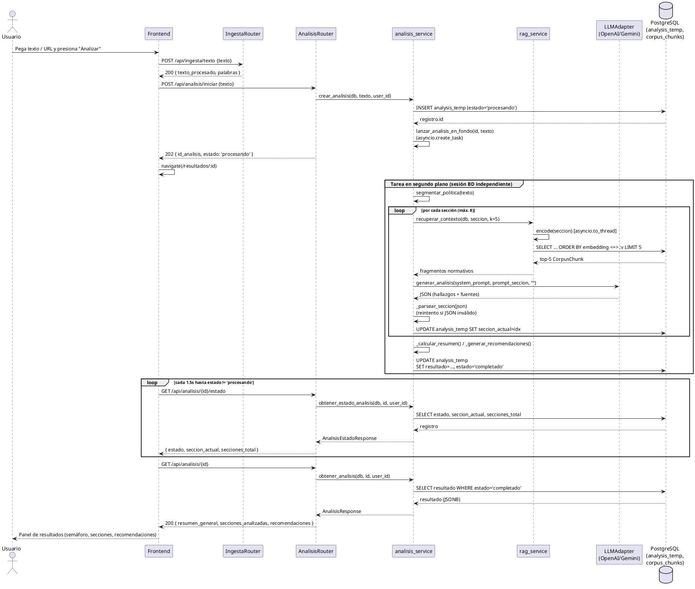
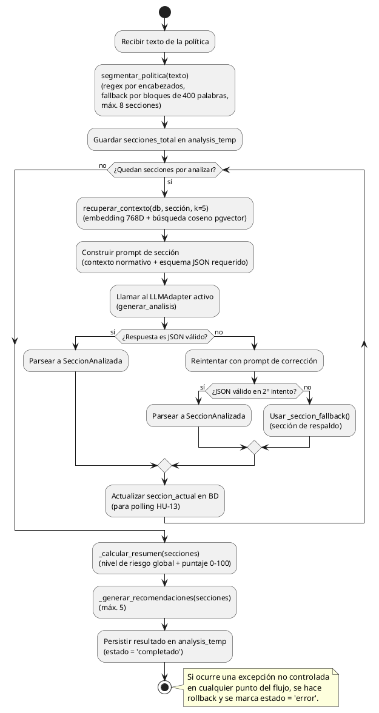
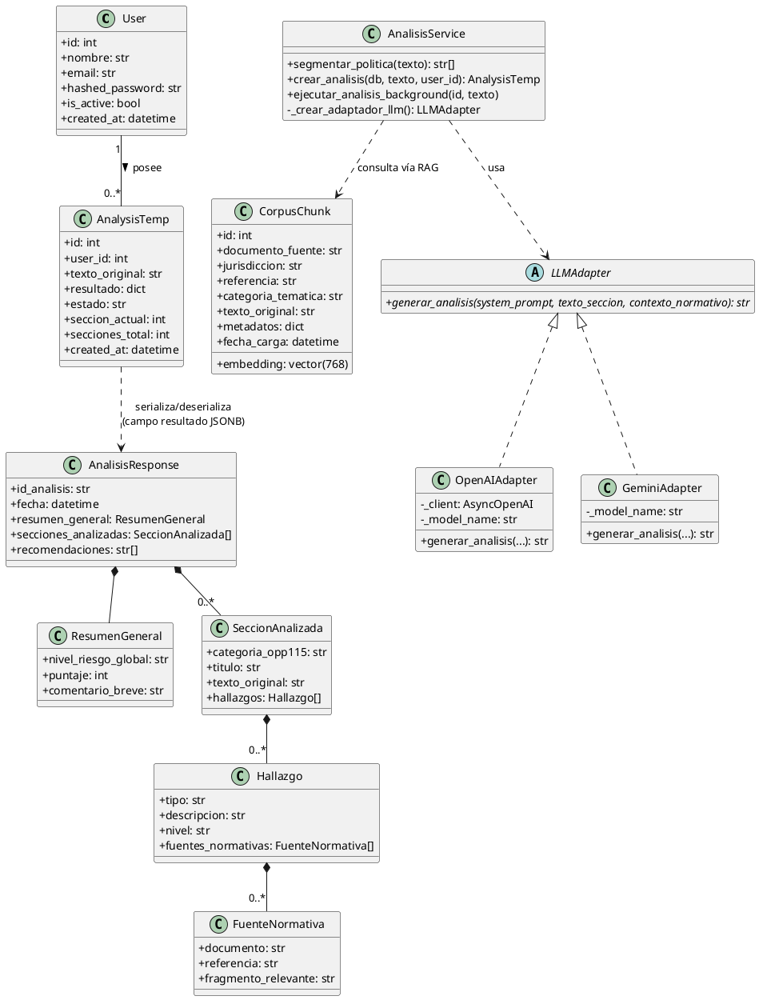
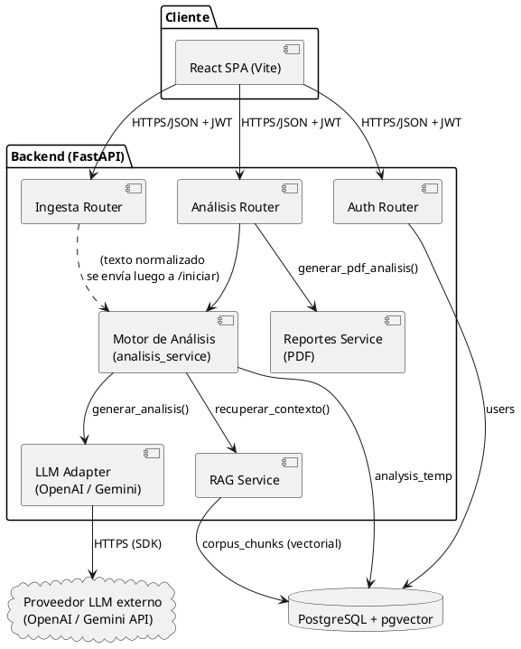

> **Nota de origen:** Este documento fue elaborado revisando directamente el código fuente del repositorio (backend y frontend), las migraciones de Alembic, `docker-compose.yml`, los Dockerfiles, `postgres/init.sql`, las pruebas automatizadas y `MANUAL_TECNICO.md`. Todo lo aquí afirmado es verificable en el código; donde el código no permite confirmar algo con certeza (por ejemplo, despliegue en Railway), se indica explícitamente como **PENDIENTE DE CONFIRMAR** en vez de inventarse. Úsalo como insumo directo para redactar el Capítulo 5, no como el capítulo ya redactado en prosa final — copia lo que te sirva y ajusta el estilo académico.

---

# Insumos reales para el Capítulo 5 — Diseño del Sistema (PrivApp)

## 5.1 Arquitectura del sistema

### Capas reales confirmadas

El sistema **no es solo "cliente–servidor–base de datos"**. Revisando el código hay, en la práctica, las siguientes capas/procesos:

1. **Cliente (frontend)** — SPA en React 18 + TypeScript + Vite, servida en desarrollo por el propio Vite dev server (`npm run dev`, puerto 5173). Consume la API vía Axios (`frontend/src/api/client.ts`).
2. **Servidor de aplicación (backend)** — API REST con FastAPI + Uvicorn (`backend/app/main.py`), que internamente se subdivide en:
   - Capa de **routers/controladores** (`app/api/v1/*`) — solo reciben la request, validan con Pydantic y delegan.
   - Capa de **servicios/lógica de negocio** (`app/services/*`) — el "motor" real del sistema.
   - Capa de **acceso a datos** vía SQLAlchemy Async (`app/database.py`, `app/models/*`) — no hay un patrón Repository formal (ver 5.2), las queries viven directamente en los servicios.
3. **Base de datos** — PostgreSQL 16 con extensión **pgvector** (`pgvector/pgvector:pg16`), un único motor que cumple dos roles distintos:
   - Almacén relacional transaccional (usuarios, análisis).
   - Almacén **vectorial** (corpus normativo con embeddings) usado como base de conocimiento para RAG.
4. **Servicio externo de IA (LLM)** — OpenAI API (`gpt-4o-mini` por defecto) o Google Gemini API, consumidos vía SDK desde `app/services/llm/*`. Es una capa externa a la infraestructura propia, consumida por HTTP/SDK.
5. **Motor de análisis como capa de orquestación propia** — `analisis_service.py` no es "solo un servicio más"; actúa como un orquestador que coordina segmentación → RAG → LLM → parseo → persistencia. Vale la pena documentarlo como una capa/subsistema aparte en 5.1, no como un servicio genérico más.
6. **Tareas en segundo plano (background tasks) dentro del propio proceso** — el análisis se ejecuta con `asyncio.create_task(...)` (`analisis_service.py:378`), **no** con una cola de tareas externa (no hay Celery, RQ, ni Redis como broker). Es concurrencia cooperativa dentro del mismo proceso Uvicorn/FastAPI, usando una sesión de BD propia e independiente de la del request HTTP que originó el análisis (necesario porque el request original ya respondió con 202 antes de que el análisis termine).
7. **Generación de reportes (PDF) como capa de presentación del lado servidor** — `reportes_service.py` construye el PDF en memoria con ReportLab, de forma síncrona/CPU-bound, ejecutada en threadpool (`run_in_threadpool`) para no bloquear el event loop.
8. **Rate limiting** como capa transversal (middleware) — SlowAPI, contador **en memoria por proceso** (no hay Redis ni almacén distribuido de rate limiting).

### Lo que **no existe** (para no inventarlo en la tesis)

- **No hay caché** (ni Redis, ni caché HTTP, ni caché de resultados de LLM). Cada análisis se recalcula desde cero.
- **No hay cola de tareas real** (Celery/RQ/SQS/etc.). El "procesamiento en segundo plano" es una tarea de `asyncio` dentro del mismo proceso.
- **No hay gestión de sesiones de servidor** (confirma lo que ya se planteaba: JWT stateless, sin sesión en BD ni en memoria).
- **No hay balanceador de carga ni múltiples réplicas configuradas** en el `docker-compose.yml` (una instancia de cada servicio).

### Servicios/procesos que corren de forma independiente

Se encontró **`docker-compose.yml`** (raíz del proyecto) con **3 servicios**:

| Servicio | Imagen/Build | Puerto | Rol |
|---|---|---|---|
| `db` | `pgvector/pgvector:pg16` | 5432 | PostgreSQL + pgvector, con healthcheck (`pg_isready`) |
| `backend` | build desde `./backend/Dockerfile` | 8000 | FastAPI + Uvicorn (`--reload`), depende de `db` (`condition: service_healthy`) |
| `frontend` | build desde `./frontend/Dockerfile` | 5173 | Vite dev server (`npm run dev -- --host 0.0.0.0`) |

Los tres corren en una red bridge común (`privapp_net`) y el volumen nombrado `postgres_data` persiste los datos de PostgreSQL.

**PENDIENTE DE CONFIRMAR:** no se encontró ningún archivo `railway.json`, `railway.toml`, ni configuración específica de Railway en el repositorio. La única definición de despliegue versionada es `docker-compose.yml` (pensado para Docker Compose local/VM, con `--reload` en Uvicorn y Vite en modo dev, lo cual sugiere que tal como está no es una configuración de producción "endurecida"). Si el prototipo se despliega en Railway, esa configuración vive fuera del repo (variables de entorno del panel de Railway, buildpacks o Dockerfiles individuales apuntando a `backend/Dockerfile` y `frontend/Dockerfile`) y debes confirmarlo tú mismo antes de afirmarlo en la tesis. Lo que sí puedes afirmar con certeza es la lista de servicios lógicos independientes (base de datos, backend, frontend), que se mantendría igual sin importar la plataforma de hosting.

---

## 5.2 Diseño de arquitectura técnica

### Patrones de diseño realmente aplicados (con ubicación exacta)

| Patrón | Dónde aparece | Evidencia |
|---|---|---|
| **Adapter** | `app/services/llm/base.py`, `openai_adapter.py`, `gemini_adapter.py` | `LLMAdapter(ABC)` define el contrato `generar_analisis(...)`; `OpenAIAdapter` y `GeminiAdapter` son implementaciones intercambiables del mismo contrato. El propio docstring del módulo lo llama explícitamente "patrón Adapter/Strategy". |
| **Strategy** (variante del Adapter anterior) | `analisis_service._crear_adaptador_llm()` (línea ~339) | Selecciona en tiempo de ejecución qué adaptador usar según `settings.llm_provider` ("openai" vs cualquier otro valor → Gemini). |
| **Factory Method** | `_crear_adaptador_llm()` en `analisis_service.py` | Función fábrica que encapsula la construcción del adaptador concreto (con su API key y modelo) sin que el resto del motor conozca la clase concreta. |
| **Dependency Injection** | Todo `app/api/**` vía `Depends()` de FastAPI | `get_db`, `get_current_user_id`, `get_current_user` (`app/api/deps.py`) se inyectan en cada endpoint; es el mecanismo de DI nativo de FastAPI, usado consistentemente en los 3 routers. |
| **Singleton perezoso (lazy singleton)** | `app/utils/embeddings.py` (`get_model()`) | Variable de módulo `_model = None`; se carga una sola vez el modelo `SentenceTransformer` y se reutiliza en toda la vida del proceso. |
| **Decorator** | `@limiter.limit(...)` (SlowAPI) en los routers; `@retry(...)` (tenacity) en los adaptadores LLM | Ambos son decoradores que añaden comportamiento transversal (límite de tasa, reintentos) sin modificar la lógica de la función decorada. |
| **Template/Fallback method** | `_seccion_fallback()` en `analisis_service.py` | Cuando el LLM falla o el JSON es inválido tras reintentos, se sustituye por una `SeccionAnalizada` de respaldo con estructura idéntica a una sección real, para que el resto del pipeline no tenga que manejar casos especiales. |
| **DTO / Schema validation** | `app/schemas/*` (Pydantic) | Objetos de transferencia de datos que validan y serializan entre capas (request → servicio → response), independientes de los modelos ORM. |

**Lo que NO está implementado** (para no inventarlo en 5.2): no hay una clase `Repository` explícita (las consultas SQLAlchemy están directamente en los archivos `*_service.py`), no hay Unit of Work explícito más allá de la sesión de SQLAlchemy, no hay Observer/Event Bus, no hay Builder, y el "Singleton" del engine de BD (`app/database.py`) es un singleton implícito de módulo, no una clase Singleton formal.

### Estructura real de carpetas del servidor

```
backend/app/
├── main.py                 # Entry point FastAPI: middlewares, routers, /health
├── config.py                # Settings (pydantic-settings) leídas de .env
├── database.py               # engine async, AsyncSessionLocal, Base, get_db()
│
├── api/
│   ├── deps.py                # Dependencias compartidas: get_current_user_id, get_current_user
│   └── v1/
│       ├── auth.py            # Router /api/auth
│       ├── ingesta.py          # Router /api/ingesta
│       └── analisis.py         # Router /api/analisis
│
├── core/
│   ├── security.py            # hash_password, verify_password, create/decode_access_token
│   ├── exceptions.py           # HTTPException personalizadas del dominio
│   └── limiter.py              # Instancia global de slowapi.Limiter
│
├── models/                   # Entidades ORM (SQLAlchemy)
│   ├── user.py                # User
│   ├── corpus.py               # CorpusChunk (pgvector)
│   └── analysis.py              # AnalysisTemp (+ TypeDecorator JSONBCompat)
│
├── schemas/                   # DTOs Pydantic (request/response)
│   ├── auth.py, user.py, ingesta.py, analysis.py, analisis_request.py
│
├── services/                  # Lógica de negocio (donde vive realmente la arquitectura en capas)
│   ├── auth_service.py          # registro/login/consulta de usuario
│   ├── ingesta_service.py        # limpieza de texto, extracción desde URL
│   ├── analisis_service.py        # MOTOR DE ANÁLISIS (orquestador principal)
│   ├── rag_service.py            # recuperación vectorial (RAG)
│   ├── reportes_service.py        # generación de PDF
│   └── llm/
│       ├── base.py               # LLMAdapter (ABC)
│       ├── openai_adapter.py       # adaptador activo
│       └── gemini_adapter.py       # adaptador alterno
│
└── utils/
    ├── embeddings.py            # encode()/encode_batch() con sentence-transformers
    ├── chunking.py               # chunk_texto() para carga del corpus
    └── pdf_extractor.py           # extraer_texto_pdf() (pdfplumber + fallback pypdf)
```

Esta es una **arquitectura en capas (layered architecture)** clásica: `api` (presentación/controladores) → `services` (lógica de negocio/orquestación) → `models` + `database` (persistencia), con `schemas` como capa de contratos de datos transversal y `core`/`utils` como utilidades compartidas. No hay separación por "features"/módulos verticales; la separación es horizontal por responsabilidad técnica.

### Mecanismos reales de reintento, manejo de errores y resiliencia

Para 5.2.3, esto es lo que **ya existe en el código** (no hace falta inventar nada):

1. **Reintentos con backoff exponencial (tenacity)** en ambos adaptadores LLM (`openai_adapter.py`, `gemini_adapter.py`):
   - `stop_after_attempt(3)`, `wait_exponential(multiplier=2, min=2, max=10)`.
   - En OpenAI: reintenta solo ante `RateLimitError` y `APIConnectionError` (errores transitorios); un `APIStatusError` con código ≥500 también se considera reintentable vía `_es_error_reintentable`, pero **el decorador `@retry` solo está configurado para `RateLimitError`/`APIConnectionError`** — es decir, hay una función auxiliar `_es_error_reintentable` que no está conectada al decorador (posible inconsistencia a documentar/corregir, no a ocultar).
   - Errores no transitorios (autenticación, modelo inválido) se envuelven en `LLMError` (HTTP 502) sin reintentar.
2. **Reintento a nivel de contenido (no de red)**: si el LLM responde un JSON inválido, `ejecutar_analisis_background()` hace un **segundo intento** pidiéndole explícitamente al modelo que corrija el JSON (`analisis_service.py:410-426`). Si ese segundo intento también falla, se usa `_seccion_fallback()` en vez de abortar todo el análisis.
3. **Degradación controlada (fallback)**: tanto errores de LLM (`LLMError`) como excepciones inesperadas durante el análisis de una sección individual quedan aisladas por sección — una sección fallida no aborta el análisis completo; se sustituye por una sección de respaldo y el resto continúa.
4. **Manejo de fallo total de la tarea de fondo**: si algo falla fuera del bucle por-sección, el `except Exception` general hace `rollback()` y marca el registro `AnalysisTemp.estado = "error"` en una transacción separada, para que el cliente (que hace *polling* a `/estado`) pueda detectar el fallo (`estado == "error"` → HU-13).
5. **Resiliencia de red en la ingesta por URL** (`ingesta_service.extraer_texto_url`): manejo diferenciado de `Timeout`, `ConnectionError`, `HTTPError` y `RequestException` genérico, cada uno mapeado a un `ExtraccionURLError` (422) con mensaje específico para el usuario.
6. **`pool_pre_ping=True`** en el engine de SQLAlchemy (`database.py`) — verifica que la conexión siga viva antes de usarla, reconectando automáticamente si la BD cerró la conexión por inactividad.
7. **Rate limiting** (SlowAPI) como mecanismo de protección de disponibilidad, no de corrección de errores, pero relevante para 5.2.3 como control de resiliencia ante abuso/sobrecarga.

**Lo que NO existe:** no hay *circuit breaker*, no hay *dead-letter queue*, no hay reintento a nivel de infraestructura (Docker `restart: unless-stopped` es lo único parecido, y aplica a caída del contenedor completo, no a errores de aplicación).

---

## 5.3 Diseño de componentes y módulos

### Módulos/archivos principales del servidor

| Archivo | Responsabilidad real |
|---|---|
| `app/main.py` | Arranque de FastAPI, registro de middlewares (CORS, rate limit), registro de routers, endpoint `/health`. |
| `app/config.py` | Configuración centralizada vía `pydantic-settings`, leída de `.env` (BD, JWT, proveedor LLM, CORS, log level). |
| `app/database.py` | Motor async de PostgreSQL, `AsyncSessionLocal`, clase base declarativa `Base`, dependencia `get_db()`. |
| `app/api/deps.py` | Decodifica el JWT del header `Authorization: Bearer`, resuelve el `User` actual, valida que esté activo. |
| `app/api/v1/auth.py` | Endpoints de registro, login, logout y perfil (`/me`). |
| `app/api/v1/ingesta.py` | Endpoints para normalizar texto pegado o extraído de una URL antes de analizarlo. |
| `app/api/v1/analisis.py` | Endpoints para iniciar el análisis, consultar su progreso/resultado, listar historial y descargar PDF. |
| `app/core/security.py` | Hash de contraseñas (bcrypt) y emisión/decodificación de JWT (HS256). |
| `app/core/exceptions.py` | Excepciones de dominio como subclases de `HTTPException` (401/404/409/422/502 según el caso). |
| `app/core/limiter.py` | Instancia única de `slowapi.Limiter` compartida por toda la app. |
| `app/models/user.py` | Entidad ORM `User`. |
| `app/models/corpus.py` | Entidad ORM `CorpusChunk` (con columna vectorial `pgvector`). |
| `app/models/analysis.py` | Entidad ORM `AnalysisTemp` + `TypeDecorator` `JSONBCompat` (JSONB en Postgres, TEXT en SQLite para tests). |
| `app/services/auth_service.py` | Registro, autenticación, búsqueda de usuario por email/id. |
| `app/services/ingesta_service.py` | Limpieza/normalización Unicode de texto, extracción de texto desde HTML (BeautifulSoup4), validación de longitud. |
| `app/services/analisis_service.py` | **Motor de análisis**: segmentación de la política, construcción de prompts, orquestación RAG+LLM, parseo/validación de JSON, cálculo del resumen/puntaje, generación de recomendaciones, ejecución en segundo plano, consulta de estado/resultado/historial. |
| `app/services/rag_service.py` | Recuperación de fragmentos normativos por similitud coseno contra `corpus_chunks` (pgvector). |
| `app/services/reportes_service.py` | Construcción del PDF de un análisis ya completado (ReportLab), en memoria. |
| `app/services/llm/base.py` | Contrato abstracto `LLMAdapter`. |
| `app/services/llm/openai_adapter.py` | Adaptador concreto activo (GPT-4o-mini, `response_format=json_object`, reintentos tenacity). |
| `app/services/llm/gemini_adapter.py` | Adaptador concreto alterno (Gemini), mantenido por compatibilidad. |
| `app/utils/embeddings.py` | Carga perezosa de `SentenceTransformer` (`paraphrase-multilingual-mpnet-base-v2`) y funciones `encode`/`encode_batch`. |
| `app/utils/chunking.py` | División de texto en fragmentos de 300-500 palabras con solapamiento de 50, para la carga del corpus. |
| `app/utils/pdf_extractor.py` | Extracción de texto de PDFs (pdfplumber primero, pypdf como respaldo). |
| `backend/scripts/cargar_corpus.py` | Script batch para poblar `corpus_chunks` a partir de los PDFs en `corpus_normativo/`. |

### Firmas/contratos internos reales

```python
# app/services/llm/base.py — contrato que deben cumplir todos los proveedores LLM
class LLMAdapter(ABC):
    async def generar_analisis(
        self,
        system_prompt: str,
        texto_seccion: str,
        contexto_normativo: str,
    ) -> str: ...  # devuelve un string JSON

# app/services/rag_service.py — cómo el motor obtiene contexto normativo (RAG)
async def recuperar_contexto(
    db: AsyncSession,
    query_text: str,
    k: int = 5,
    filtro_jurisdiccion: str | None = None,
    filtro_categoria: str | None = None,
) -> list[CorpusChunk]: ...

# app/utils/embeddings.py — cómo se obtiene el vector de un texto
def encode(texto: str) -> list[float]: ...  # 768 dimensiones, normalizado L2

# app/services/analisis_service.py — selección del proveedor LLM activo
def _crear_adaptador_llm() -> LLMAdapter: ...

# app/services/reportes_service.py — generación del PDF
def generar_pdf_analisis(analisis: AnalisisResponse) -> bytes: ...
```

Esto responde directamente a lo que pediste: *"qué función llama el motor de análisis para obtener vectores"* → no llama a `encode()` directamente, llama a `recuperar_contexto()` (que internamente hace `asyncio.to_thread(encode, query_text)` para no bloquear el event loop, ver `rag_service.py:45`); *"qué función llama para consultar el adaptador de proveedor"* → `llm.generar_analisis(SYSTEM_PROMPT, user_msg, "")` sobre la instancia devuelta por `_crear_adaptador_llm()`.

### Endpoints reales de la API

| Método | Ruta | Propósito | Auth | Rate limit |
|---|---|---|---|---|
| GET | `/health` | Verifica que el backend está en línea | No | — |
| POST | `/api/auth/register` | Registra usuario, devuelve JWT | No | 10/min |
| POST | `/api/auth/login` | Autentica y devuelve JWT | No | 5/min |
| POST | `/api/auth/logout` | Cierre de sesión (invalidación solo del lado cliente) | Sí | — |
| GET | `/api/auth/me` | Perfil del usuario autenticado | Sí | — |
| POST | `/api/ingesta/texto` | Normaliza texto pegado directamente | Sí | 20/min |
| POST | `/api/ingesta/url` | Descarga y extrae texto de una URL | Sí | 10/min |
| POST | `/api/analisis/iniciar` | Crea el análisis y lo procesa en segundo plano (202) | Sí | 5/min |
| GET | `/api/analisis/{id}/estado` | Consulta el progreso del análisis (HU-13) | Sí | — |
| GET | `/api/analisis/{id}` | Recupera el resultado de un análisis completado | Sí | — |
| GET | `/api/analisis` | Lista paginada del historial del usuario (`page`, `page_size`) | Sí | — |
| GET | `/api/analisis/{id}/pdf` | Genera y descarga el reporte PDF | Sí | 10/min |

También expuestos automáticamente por FastAPI: `/docs` (Swagger UI) y `/redoc`.

### Clases/modelos de datos reales

**Entidades ORM (persistidas en BD):**

- **`User`** (`users`): `id: int`, `nombre: str`, `email: str` (único), `hashed_password: str`, `is_active: bool`, `created_at: datetime`.
- **`CorpusChunk`** (`corpus_chunks`): `id: int`, `documento_fuente: str`, `jurisdiccion: str`, `referencia: str | None`, `categoria_tematica: str | None`, `texto_original: str`, `embedding: Vector(768)`, `metadatos: dict | None` (JSONB), `fecha_carga: datetime`.
- **`AnalysisTemp`** (`analysis_temp`): `id: int`, `user_id: int` (FK → `users.id`), `texto_original: str`, `resultado: dict | None` (JSONB/TEXT), `estado: str`, `seccion_actual: int`, `secciones_total: int | None`, `created_at: datetime`.

**DTOs Pydantic (no persistidos, viajan entre capas):** `FuenteNormativa`, `Hallazgo`, `SeccionAnalizada`, `ResumenGeneral`, `AnalisisResponse`, `AnalisisHistorialItem`, `HistorialResponse`, `AnalisisIniciadoResponse`, `AnalisisEstadoResponse`, `IngestaTextoRequest`, `IngestaURLRequest`, `RegisterRequest`, `LoginRequest`, `TokenResponse`, `UserResponse`.

Este es el insumo real para el diagrama de clases de 5.7.

---

## 5.4 Diseño de base de datos

### Esquema real de tablas (confirmado con migraciones Alembic 0001-0004 + `postgres/init.sql`)

**`users`** (migración `0001_create_users_table.py`)

| Columna | Tipo | Restricciones |
|---|---|---|
| `id` | SERIAL | PK, index |
| `nombre` | VARCHAR(100) | NOT NULL |
| `email` | VARCHAR(255) | NOT NULL, **UNIQUE**, index |
| `hashed_password` | VARCHAR(255) | NOT NULL |
| `is_active` | BOOLEAN | DEFAULT true |
| `created_at` | TIMESTAMPTZ | DEFAULT now() |

**`corpus_chunks`** (migración `0002_corpus_chunks_table.py`, también creada por `postgres/init.sql` con `CREATE TABLE IF NOT EXISTS`)

| Columna | Tipo | Restricciones |
|---|---|---|
| `id` | SERIAL | PK |
| `documento_fuente` | VARCHAR(255) | NOT NULL |
| `jurisdiccion` | VARCHAR(50) | NOT NULL, index |
| `referencia` | VARCHAR(255) | nullable |
| `categoria_tematica` | VARCHAR(100) | nullable, index |
| `texto_original` | TEXT | NOT NULL |
| `embedding` | **vector(768)** | NOT NULL, index IVFFlat (`vector_cosine_ops`, lists=100) |
| `metadatos` | JSONB | nullable |
| `fecha_carga` | TIMESTAMPTZ | DEFAULT now() |

**`analysis_temp`** (migración `0003_analysis_temp_table.py` + `0004_analysis_progreso.py`)

| Columna | Tipo | Restricciones |
|---|---|---|
| `id` | SERIAL | PK |
| `user_id` | INTEGER | **FK → users(id) ON DELETE CASCADE**, NOT NULL, index |
| `texto_original` | TEXT | NOT NULL (solo primeros 2000 chars, ver `analisis_service.py:360`) |
| `resultado` | JSONB | nullable (el `AnalisisResponse` serializado) |
| `estado` | VARCHAR(20) | DEFAULT 'pendiente' (valores reales usados: `procesando`, `completado`, `error`), index |
| `seccion_actual` | INTEGER | NOT NULL, DEFAULT 0 (añadida en 0004) |
| `secciones_total` | INTEGER | nullable (añadida en 0004) |
| `created_at` | TIMESTAMPTZ | DEFAULT now() |

> **Importante:** `MANUAL_TECNICO.md` (sección 5) documenta `analysis_temp` **sin** `seccion_actual`/`secciones_total` — está desactualizado respecto a la migración 0004 (progreso HU-13) y respecto a los endpoints reales (no menciona `GET /api/analisis` de historial ni `GET /api/analisis/{id}/pdf`). Usa la tabla de arriba, no la del manual técnico, para el Capítulo 5.

### Relaciones reales entre tablas

- **`users` 1 — N `analysis_temp`**: cada análisis pertenece a exactamente un usuario (`analysis_temp.user_id → users.id`, `ON DELETE CASCADE`: si se borra un usuario, se borran sus análisis).
- **`corpus_chunks` no tiene relación FK con ninguna otra tabla.** Es la base de conocimiento del RAG, consultada por contenido semántico (similitud de embeddings), no por clave foránea. No se relaciona con `users` ni con `analysis_temp` a nivel de esquema — la relación es lógica/de aplicación (un análisis *usa* fragmentos del corpus para construir el prompt, pero eso no se persiste como relación, solo el resultado final queda embebido dentro de `analysis_temp.resultado`).

### Vectores (pgvector)

Confirmado en tres lugares consistentes entre sí: el modelo ORM (`models/corpus.py`: `Vector(768)`), la migración 0002 (`vector(768)`) y `postgres/init.sql` (`vector(768)`). La dimensión **768** corresponde al modelo de embeddings `paraphrase-multilingual-mpnet-base-v2` (`utils/embeddings.py`), confirmado por el propio log de carga (`Modelo cargado. Dimensión: %d`). La tabla que almacena los vectores es únicamente `corpus_chunks.embedding`.

### Diccionario de datos

No existe una herramienta que genere un diccionario de datos automáticamente (no hay `dbdocs`, `schemaspy` ni similar configurado). Lo más cercano es:
- Los comentarios/docstrings dentro de cada migración Alembic (breves, ej. "Nota: la tabla también puede existir si el contenedor fue inicializado con postgres/init.sql").
- La tabla informal en `MANUAL_TECNICO.md` sección 5 (parcial y desactualizada, ver nota arriba).
- Los propios nombres de columnas en español, autoexplicativos.

Para el diccionario de datos formal de 5.4 tendrás que construirlo tú a partir de las tablas reales documentadas arriba — no hay una fuente ya generada que puedas citar como definitiva.

---

## 5.5 Diseño de interfaz de usuario

### Pantallas/vistas reales (componentes de página en `frontend/src/pages/`)

| Página | Ruta | Protegida | Descripción real |
|---|---|---|---|
| `Login.tsx` | `/login` | No | Formulario de inicio de sesión |
| `Register.tsx` | `/registro` | No | Formulario de registro |
| `Dashboard.tsx` | `/dashboard` | Sí | Pantalla de bienvenida con 2 accesos: "Analizar política" e "Historial" |
| `Ingesta.tsx` | `/analizar` | Sí | Formulario con pestañas "Pegar texto" / "Desde URL" (`IngestaForm.tsx`) |
| `Resultados.tsx` | `/resultados/:id` | Sí | Vista de progreso (mientras `estado==='procesando'`) y luego panel de resultados completo |
| `Historial.tsx` | `/historial` | Sí | Lista paginada de análisis previos del usuario |

`/` redirige a `/dashboard` (`<Navigate to="/dashboard" replace />`).

### Flujo real de navegación (React Router, `App.tsx`)

```
/login, /registro  ──(login/registro exitoso)──▶  /dashboard
                                                       │
                              ┌────────────────────────┼───────────────────────┐
                              ▼                                                ▼
                        /analizar                                        /historial
                    (pega texto o URL)                              (lista paginada)
                              │                                                │
                              ▼ POST /api/ingesta/*                            │
                              ▼ POST /api/analisis/iniciar (202)               │
                              ▼                                                │
                    /resultados/:id  ◀───────────────────────────────────────┘
                    (poll GET /estado cada 1.5s hasta 'completado' o 'error')
                              │
              ┌───────────────┼────────────────────┐
              ▼                                    ▼
      "Analizar otra política" → /analizar   "Descargar PDF" (GET /{id}/pdf, blob)
```

Todas las rutas protegidas están envueltas por un único elemento `<Route element={<ProtectedRoute />}>` (`ProtectedRoute.tsx`), que redirige a `/login` si no hay usuario autenticado, usando el estado de `AuthContext` (JWT persistido en `localStorage`, verificado contra `GET /api/auth/me` al montar la app).

### Decisiones de diseño visual reales (más allá de Tailwind genérico)

- **Paleta semántica de riesgo**, definida en `tailwind.config.js` (`colors.riesgo.alto/medio/bajo` = `#ef4444` / `#f59e0b` / `#22c55e`), aunque en la práctica la mayoría de componentes usan directamente las clases estándar de Tailwind (`bg-red-500`, `bg-yellow-400`, `bg-green-500`) en vez del token `riesgo.*` — vale la pena mencionarlo como una inconsistencia menor de implementación si se documenta un "sistema de diseño".
- **Tipografía:** familia `Inter` como fuente principal (`fontFamily.sans` extendido), tamaño base `1rem` con `line-height: 1.6` (pensado para legibilidad, coherente con el público joven objetivo del sistema).
- **Componentes de diseño reutilizables** definidos como clases de utilidad compuestas en `index.css` (`@layer components`): `.btn-primary`, `.btn-secondary`, `.input-field`, `.card` — es decir, sí existe un pequeño sistema de diseño propio por encima de Tailwind puro, no solo utilidades sueltas.
- **Iconografía consistente** con la librería `lucide-react` (ShieldCheck, LogOut, FileSearch, ArrowLeft, Download, ShieldAlert, ChevronLeft/Right/Up/Down, Lightbulb).
- **Metáfora de semáforo** (verde/amarillo/rojo) como lenguaje visual central para comunicar nivel de riesgo (`IndicadorSemaforo.tsx`), reforzada con un indicador circular de puntaje 0–100.
- **Layout mobile-first**, contenedores centrados con `max-w-2xl`/`max-w-4xl`.

### Capturas de pantalla

No se encontraron capturas ni prototipos (Figma, imágenes) versionados en el repositorio. Como ya planeas insertarlas manualmente en la presentación, en el documento de tesis puedes referenciar directamente las rutas/componentes de arriba y capturarlas tú mismo ejecutando la app (`npm run dev` en `frontend/`).

---

## 5.6 Diseño de la seguridad

### Autenticación

- **Tipo de token:** JWT (JSON Web Token).
- **Biblioteca:** `python-jose[cryptography]` (backend, `core/security.py`), consumido en frontend simplemente como string Bearer (sin decodificarlo del lado cliente).
- **Algoritmo:** HS256 (`settings.jwt_algorithm`, configurable pero por defecto HS256).
- **Tiempo de expiración:** 24 horas por defecto (`jwt_expiration_hours: int = 24`, configurable vía `.env`).
- **Payload:** `{"sub": "<user_id>", "exp": <timestamp>}` — mínimo, sin roles ni claims adicionales.
- **Transporte:** header `Authorization: Bearer <token>`, validado con `HTTPBearer` de FastAPI (`api/deps.py`).
- **Password hashing:** `bcrypt` vía `passlib.context.CryptContext(schemes=["bcrypt"])` — cost factor por defecto de passlib/bcrypt (no se sobrescribe explícitamente en el código, por lo que aplica el default de la librería, típicamente 12 rounds).
- **Validación de fortaleza de contraseña** (`schemas/auth.py`): mínimo 8 caracteres, al menos una mayúscula, al menos un dígito (validador Pydantic `field_validator`).

### Gestión de sesiones

El sistema **no mantiene estado de sesión en el servidor** (coherente con lo que planteas como RE-01): no hay tabla de sesiones, no hay almacén de tokens activos/revocados, no hay cookies de sesión. El endpoint `POST /api/auth/logout` (`api/v1/auth.py:40-43`) es, literalmente por su propio comentario en el código, un no-op de negocio del lado servidor — solo responde un mensaje de confirmación; **la invalidación real del token ocurre en el cliente**, que borra el JWT de `localStorage` (`AuthContext.tsx`, función `logout`). Esto significa que un JWT ya emitido sigue siendo técnicamente válido hasta su expiración natural (24h) aunque el usuario haga logout — es una limitación real de diseño a documentar, no un mecanismo de invalidación activa.

### Cifrado de datos

- **Contraseñas:** hash con **bcrypt** (nunca se almacena ni se loguea texto plano; el hash se guarda en `users.hashed_password`).
- **Datos en tránsito:** el código de la aplicación **no implementa TLS/HTTPS por sí mismo** (FastAPI/Uvicorn corren en HTTP plano dentro del contenedor); el cifrado en tránsito, si existe en producción, dependería de un proxy inverso o del propio proveedor de hosting (fuera del código de este repositorio) — **PENDIENTE DE CONFIRMAR** según cómo se despliegue realmente el prototipo.
- **Datos en reposo:** no hay cifrado a nivel de columna ni de aplicación sobre `email`/`nombre` (se almacenan en texto plano en PostgreSQL); solo la contraseña está protegida (por hashing, no por cifrado reversible). No se detectó configuración de cifrado a nivel de disco/volumen de PostgreSQL en `docker-compose.yml`.
- **Secrets:** `JWT_SECRET_KEY`, `OPENAI_API_KEY`, `GEMINI_API_KEY` y credenciales de PostgreSQL se leen exclusivamente de variables de entorno (`.env`, excluido de git); el logging evita registrar las API keys.

### Otros controles de seguridad presentes

- **CORS** configurado explícitamente por variable de entorno `CORS_ORIGINS` (lista blanca de orígenes).
- **Rate limiting por endpoint** (SlowAPI) como control adicional contra abuso (fuerza bruta en login, spam de registros, abuso del LLM).
- **Autorización a nivel de recurso:** los endpoints de análisis siempre filtran por `user_id` (`AnalysisTemp.user_id == current_user.id`), de modo que un usuario no puede leer análisis de otro usuario aunque adivine el ID.

---

## 5.7 Diagramas UML

### Diagramas viables con precisión real

Con lo confirmado en el código, es razonable generar con datos reales (no genéricos):

- ✅ **Casos de uso** — actores y flujos confirmados.
- ✅ **Secuencia** — al menos 2 flujos reales bien definidos (registro/login, y el flujo completo de análisis con *polling*).
- ✅ **Actividades** — el pipeline interno del motor de análisis está perfectamente documentado en el código (`analisis_service.py`) para modelarlo con fidelidad.
- ✅ **Clases** — hay entidades ORM reales + DTOs reales + jerarquía de adaptadores (`LLMAdapter`), suficiente para un diagrama de clases con contenido real, no inventado.
- ✅ **Componentes** — se puede derivar directamente de la arquitectura en capas de 5.1/5.3.

Como se comentó, **casos de uso, secuencia y actividades se concentran en 5.7** (son los diagramas de *comportamiento*, con sentido propio como diagrama independiente). **Clases y componentes** son estructurales y están fuertemente ligados a 5.1/5.3 — te recomiendo mantenerlos también en 5.7 como diagramas propios (con su numeral, ej. 5.7.4 y 5.7.5), pero **referenciando cruzado** hacia 5.1 (arquitectura) y 5.3 (módulos/entidades) en el texto, en vez de repetir la explicación — así evitas duplicar contenido y mantienes 5.7 como el capítulo "solo diagramas".

### Actores reales del sistema

Revisando `models/user.py` y `auth_service.py`: **no existe ningún campo de rol** (`is_admin`, `role`, etc.) en el modelo `User`. Por lo tanto, a nivel de código **solo hay un actor humano: el usuario ciudadano autenticado** (no hay rol de administrador implementado). Para el diagrama de casos de uso, los actores reales son:

- **Usuario ciudadano** (actor primario, autenticado vía JWT) — registra su cuenta, ingresa políticas de privacidad, consulta resultados/historial, descarga reportes.
- **Proveedor LLM (OpenAI / Gemini)** (actor secundario, sistema externo) — recibe el prompt y devuelve el análisis en JSON.
- (Opcional, como actor secundario del sistema, no humano) **Corpus normativo (pgvector)** si quieres modelarlo explícitamente como fuente de datos externa al caso de uso "Analizar política".

**No documentes un actor "Administrador"** a menos que sea un requisito planeado a futuro no implementado aún — decláralo así explícitamente en la tesis si el comité pregunta por roles, para ser coherente con lo que el código realmente permite hoy.

---

### 5.7.1 Diagrama de casos de uso (PlantUML)



---

### 5.7.2 Diagrama de secuencia — Registro e inicio de sesión



---

### 5.7.3 Diagrama de secuencia — Flujo completo de análisis (con polling)



---

### 5.7.4 Diagrama de actividades — Motor de análisis (`ejecutar_analisis_background`)



---

### 5.7.5 Diagrama de clases (entidades + adaptadores LLM)



---

### 5.7.6 Diagrama de componentes



---

## Resumen de discrepancias/pendientes a resolver antes de redactar el capítulo final

1. **Despliegue en Railway:** no confirmado en el repo; solo existe `docker-compose.yml` + Dockerfiles individuales. Confirma tú mismo si Railway usa esos mismos Dockerfiles o una configuración distinta.
2. **`MANUAL_TECNICO.md` está desactualizado** respecto al código actual: le faltan `seccion_actual`/`secciones_total` en `analysis_temp`, el endpoint de historial (`GET /api/analisis`), el endpoint de PDF (`GET /api/analisis/{id}/pdf`), la página `Historial.tsx` y el componente `VistaProgreso.tsx`. Usa el código (y este documento) como fuente de verdad, no el manual.
3. **`_es_error_reintentable` en `openai_adapter.py`** está definida pero no conectada al decorador `@retry` (que solo reintenta `RateLimitError`/`APIConnectionError`) — si lo mencionas en la tesis como mecanismo de resiliencia, sé preciso sobre qué está realmente conectado.
4. **No hay actor "Administrador"** implementado — si tu tesis originalmente planteaba ese rol, deberás aclarar que es un alcance futuro, no una funcionalidad actual.
5. **Paleta `riesgo.*` de Tailwind** está declarada pero subutilizada (los componentes usan clases Tailwind estándar en su lugar) — menciónalo solo si te preguntan por consistencia del sistema de diseño.
